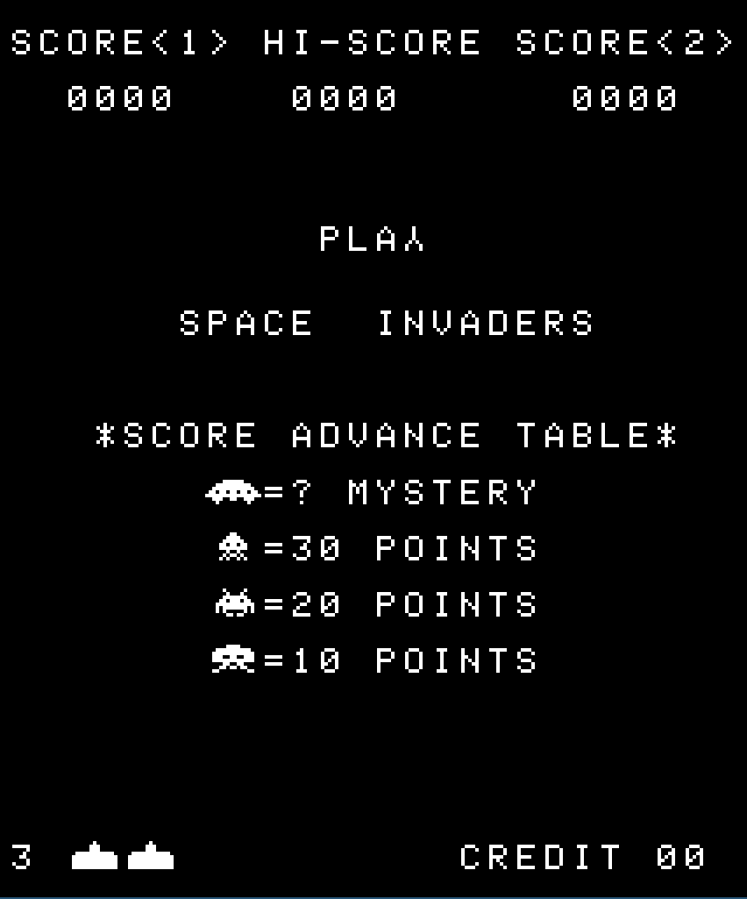
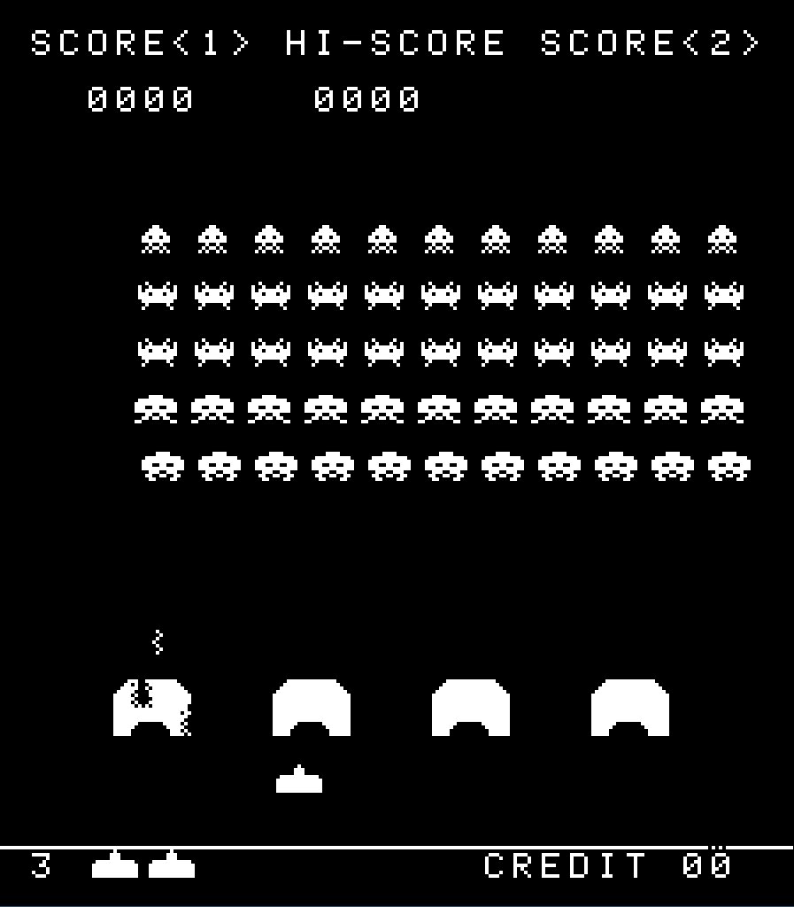

# A Space Invaders Using C++ and SDL2.





# Building
* this is only tested on linux
* you need to have SDL2 installed in your system

```bash
    make
```
and you will find the executable in bin directory

## Running:
- you need to provide the ROM files and combine them into one file, by order: .h, .g, .f, .e

## TODO

* Implement AC flag
* Add sound support
* Add color support

## Useful links
* [Emulator 101](http://emulator101.com/)
* [Computer Archeology](http://computerarcheology.com/Arcade/SpaceInvaders)
* the Intel 8080 manual
* [I8080 Tests](https://altairclone.com/downloads/cpu_tests/)
